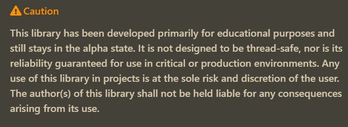

[](https://github.com/Zamuhrishka/UglyDataStructures/actions/workflows/UnitTests.yml)
[](https://github.com/Zamuhrishka/UglyDataStructures/actions/workflows/FunctionalTests.yml)


# Ugly Data Structures: Crafting Core Data Structures in C


This library based on data containers from [UglyContainers](https://github.com/Zamuhrishka/UglyContainers) repo. The primary goal of writing this library was an attempt to study data structures and algorithms. As is commonly known, the best way to learn something is to implement it. However, implementing data structures in languages like Python and C++ isn't as intriguing, as these languages already have built-in data structures. Therefore, C was chosen as the main development language. Another reason for this choice was the ambition to create a convenient and universal library for working with data structures and algorithms.

## Disclaimer



## Project Structure

The project consists of the following modules:

- core
- structs
- algorithms

### Core Module

This is the central module of the entire library which implements the universal container for data storage.
A universal container holds user data and provides the necessary operations to work with this data. For more information please look at [UglyContainers](https://github.com/Zamuhrishka/UglyContainers) repo

### Structs

This module contains implementations of data structures based on the containers of the `Core` module and special data structure interface which need to be supported by all data structures to has  unify interface for algorithm module.

#### Data Structure Interface

This interface represents the following structure:

```c
typedef struct
{
  container_t *container;
  void *meta;
} ds_t;
```

where

- `container` this is pointer to the universal container.
- `meta` this is pointer to the private structure which contain meta data specific for current data structure.

This interface provides universal access to the fields of the data structure necessary for the Algorithm module operation.

#### Data Structures

##### Queue

Implementation of a queue based on a container linked list.

```c
queue_t* queue = queue_create(10, sizeof(uint32_t));

uint32_t data = 0x55;
bool status = queue_add(queue, &data);
status = queue_get(queue, &data);
```

##### Stack

Stack implementation based on container vector.

```c
stack_t* stack = rb_create(10, sizeof(uint32_t));

uint32_t data = 0x55;
bool status = stack_push(queue, &data);
status = stack_pop(queue, &data);
```

##### Ring Buffer

Implementation of a ring buffer based on container vector.

```c
ring_buffer_t* rb = stack_create(10, sizeof(uint32_t));

uint32_t data = 0x55;
bool status = rb_add(queue, &data);
status = rb_get(queue, &data);
```

### Algorithms

This module contains implementations of various algorithms that adapt to use with data structures from `struct` module. This module is in developing state right now.

## Unit Tests

I am not a QA engineer, so my approach to the organization of testing may seem strange, but I divided the tests into two types: unit tests and functional tests, which are located in the corresponding folders in the `test` directory.

- unit tests - test individual functions.
- functional tests - test the module functionality. For example, whether the sorting function sorts the data correctly and the comparison function compares the data.

All tests were written by using [Ceedling framework](https://github.com/ThrowTheSwitch/Ceedling).
So for run unit tests you need to install this framework using instruction from framework [repository](https://github.com/ThrowTheSwitch/Ceedling) and execute command `ceedling test:all`.

## Contributing

Bug reports and/or pull requests are welcome. In case of any questions please contact me. All contact information can be found on my profile main page.
